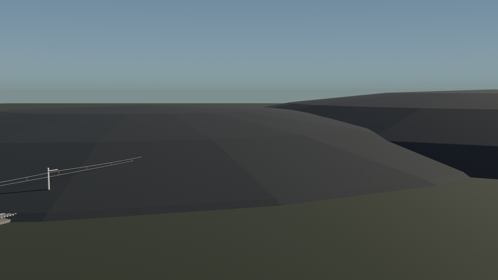
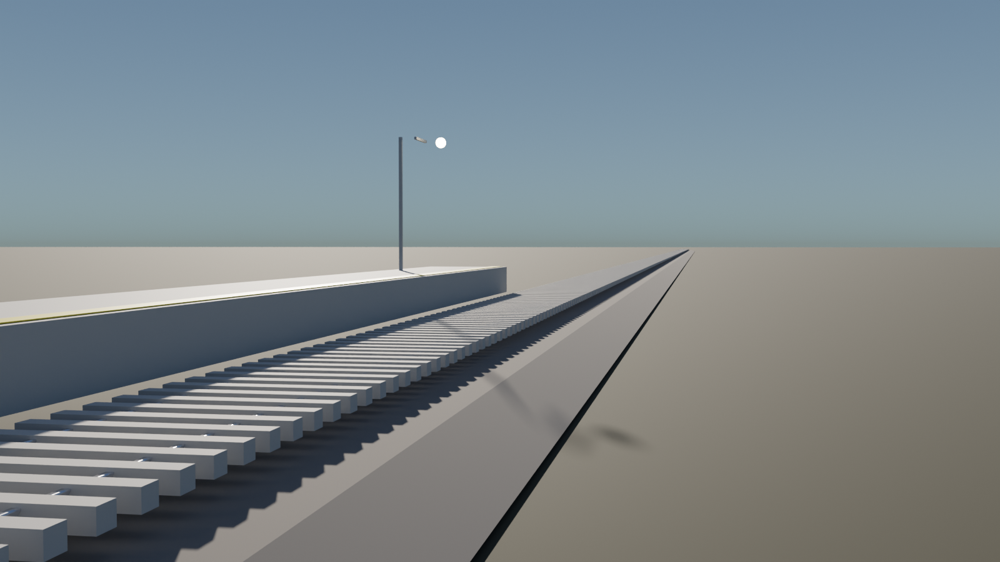
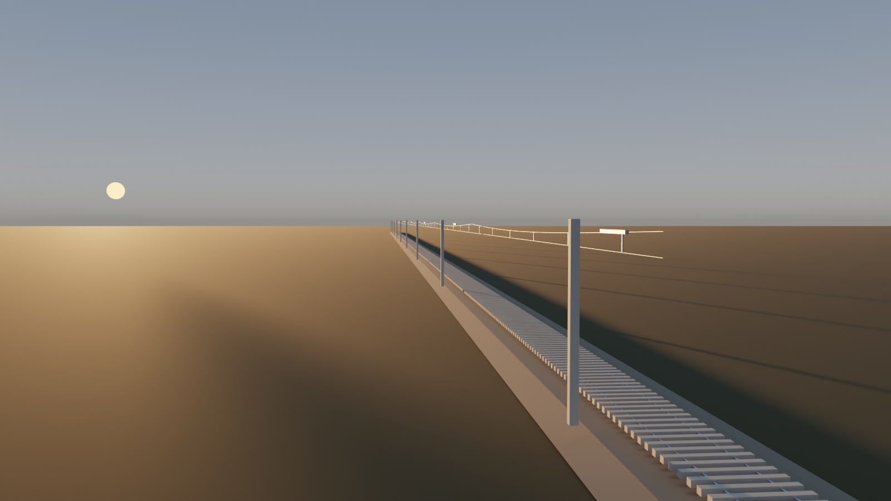
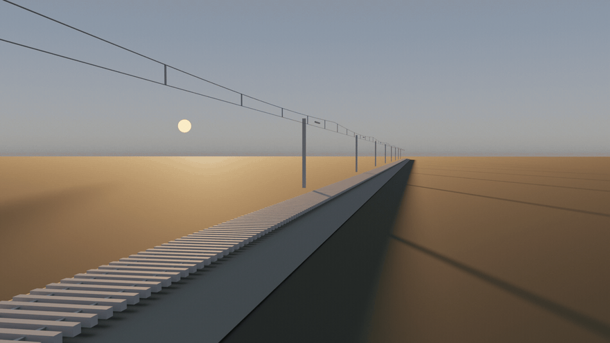

# 🛤️ rail-cinema

**EN:** An **infinite railway** generator — give it a piecewise path (straights + arcs) and it lays out real railway engineering: UIC-60 rail profile swept along the centerline, concrete sleepers at 0.60 m, ballast shoulder ribbon, and a full **catenary system** (masts, cantilevers, sagging messenger wire, contact wire). Curves carry **superelevation** computed from design speed (h = 11.8·v²/R, capped at 150 mm) — the whole cross-section rolls about the tangent.

**TR:** **Sonsuz demiryolu** üreteci — düz + viraj parçalarından oluşan patikayı ver, gerçek demiryolu mühendisliğini döşesin: merkez hatta boyunca süpürülmüş UIC-60 ray profili, 0.60 m aralıklı beton traversler, balast şeridi ve tam **katoneri sistemi** (direkler, konsollar, sarkalı mesajer teli, muhabere teli). Virajlarda **süpereleyisyon** tasarım hızından hesaplanır (h = 11.8·v²/R, 150 mm ile sınırlı) — kesit teğet etrafında yatar.



## 🖼️ Gallery / Galeri

### ⛰️ Yayla Kırşası — S virajı, süpereleyisyonlu

R500 + R350 counter-curves, the outer rail rides 150 mm high through both. — *R500 + R350 ters virajlar, dış ray her ikisinde de 150 mm yüksekte.*

### 🚉 İstasyon — peron

`hat.peron` config adds a raised platform: concrete band, yellow safety line, lamp posts, sign board — all following the track frame. — *`hat.peron` ayarı yükseltilmiş platform açar: beton bant, sarı güvenlik çizgisi, lamba direkleri, tabela — hepsi hat çerçevesini izler.*

### 🌅 Ova Düzlüğü — sonsuz düz hat

One-point perspective down a 460 m straight at golden hour, masts marching to the vanishing point. — *Altın saatte 460 m'lik düz hatta tekkacılı perspektif, direkler ufka yürür.*


*36-frame camera dolly tracking the line at 9 m/s.* — *Hattı 9 m/s'de takip eden 36 karelik kamera yürüyüşü.*

## 🧱 Physics / Fizik

| Piece | Detail |
|---|---|
| 📐 Path | Piecewise straight/arc; frames give position, tangent, right-normal at any arc-length s |
| 🛤️ Gauge | 1.435 m between rail centers — held exactly, even canted |
| ↩️ Superelevation | cant = min(11.8·v²/R, 150 mm) → cross-section roll about the tangent |
| 🪝 Catenary | messenger sag = 0.35·sin(π·faz) between masts; hangers every 8 m |
| ♾️ Infinite | `Patika.cerceve(s)` answers for ANY s — geometry is generated, not stored |

## ✅ Verification / Doğrulama

```bash
python3 tests/verify.py
```

- **Gauge gate**: rail-to-rail distance = 1.435 m within 0.002 m at every sample, canted curves included
- **Integration gate**: chord length on R500 arc matches analytic 2R·sin(ds/2R) to 1e-9
- **Cant gate**: outer rail rise = 150.0 mm on the R500 curve
- **Continuity gate**: tangent jump at segment joints < 1e-5 degrees
- **Arclength + determinism** gates

## 🚀 Usage / Kullanım

```bash
blender --background --python rail_render.py -- --scene scenes/yay_kirsasi.json
HIZLI=1 blender --background --python rail_render.py -- --scene scenes/ova_duzlugu.json  # onizleme
blender --background --python rail_render.py -- --scene scenes/ova_dolly.json --gif 36 --fps 12
```

Sahne JSON'u: `patika.segments` (düz/viraj parçaları + tasarım hızı), `hat` (travers/katoneri aralıkları), `zemin` (renk + uz tepeler), `sun/sky/camera` (`sabit` veya patikayı takip eden `dolly`).

**Kardeş projeler:** [`train-cinema`](https://github.com/efealtiparmakoglu/train-cinema) bu hattın üstüne fonksiyonel lokomotif koyar; [`railway-cinema`](https://github.com/efealtiparmakoglu/railway-cinema) ikisini birleştirip sefere çıkarır.

## 🧪 Why / Neden

**TR:** "Ray çizmek" kolay; demiryolu, geometrisi yasalarla belirlenmiş bir makinedir: genişlik milimetrik sabit, virajda hız süpereleyisyonu belirler, katoneri teli iki direk arasında sarkar. Bu repo o yasaları üreticinin içine gömer — render, matematikten sonra gelen formalitedir.

## 📄 License

MIT
